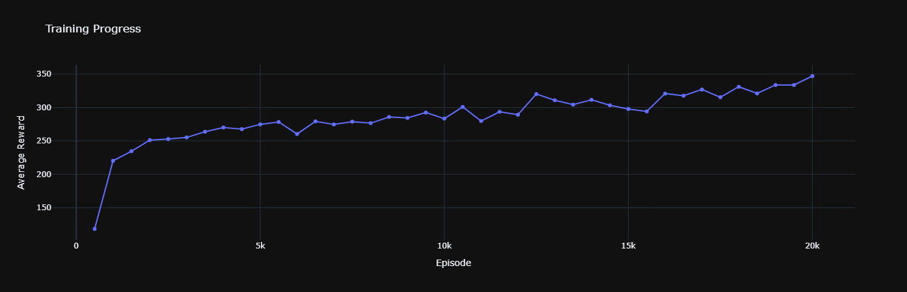
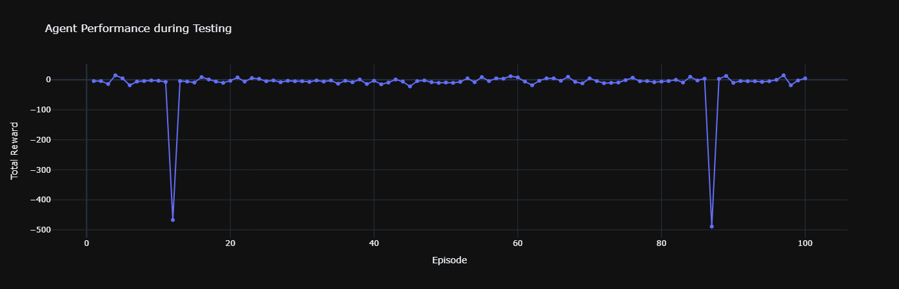

# Q-Learning Agent for Snake Game 🐍

This project presents the design and implementation of an intelligent agent that learns to play the classic Snake game using Reinforcement Learning (RL). The agent is trained with the Q-Learning algorithm to maximize its score by consuming food and avoiding collisions.

## Environment

The game environment is built using **OpenAI Gym** and **Pygame**. It handles the core game logic, including snake movement, food placement, and collision detection.

- **State Representation**: The agent perceives the environment through a simplified state defined by a tuple: `(snake_head_position, food_position, direction)`.
- **Action Space**: The agent can perform one of four discrete actions: `Up`, `Down`, `Left`, `Right`.
- **Reward Function**: The reward system was custom-designed to guide the learning process effectively:
    - **Eating Food**: `+200` points to strongly incentivize finding food.
    - **Collision**: `-10` points for colliding with a wall or its own body.
    - **Moving Closer to Food**: `+1` point for each step that reduces the distance to the food.
    - **Moving Away from Food**: `-1` point for moving farther from the food.

---

## Approach: Q-Learning

The agent employs the **Q-Learning** algorithm, a model-free RL method, to learn the optimal policy. The Q-value for a given state-action pair is updated using the Bellman equation:

$$Q(s,a) \leftarrow Q(s,a) + \alpha [r + \gamma \max_{a'} Q(s',a') - Q(s,a)]$$

Where:
- $\alpha$ (alpha) is the learning rate.
- $\gamma$ (gamma) is the discount factor.
- An **epsilon-greedy** strategy is used to balance exploration (taking random actions) and exploitation (choosing the best-known action).

---

## Training and Results

The agent was trained for **20,000 episodes**. The learning parameters were set as follows:
- **Learning Rate ($\alpha$)**: 0.05
- **Discount Factor ($\gamma$)**: 0.9
- **Initial Epsilon**: 1.0 (decays over time to 0.01)

### Training Progress

The average reward per 500 episodes shows a clear positive trend, indicating that the agent successfully learned to improve its policy over time.




### Evaluation

After training, the agent was evaluated over 100 test episodes. The final average reward during testing was **-12.66**. Although the score is negative, it shows a significant improvement over earlier stages, with the agent successfully avoiding catastrophic failures in most episodes.



---

## How to Run

1.  **Clone the repository:**
    ```bash
    git clone [https://github.com/arsalankhd/RL-Snake-Game.git](https://github.com/arsalankhd/RL-Snake-Game.git)
    cd RL-Snake-Game
    ```

2.  **Install dependencies:**
    ```bash
    pip install -r requirements.txt
    ```

3.  **Run the Jupyter Notebook:**
    Open and run the cells in `notebooks/Snake_RL_Agent_Training.ipynb` to see the training process and results.

## Technologies Used
- Python
- NumPy
- OpenAI Gym
- Pygame
- Plotly
